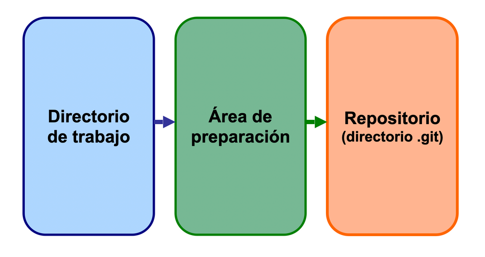
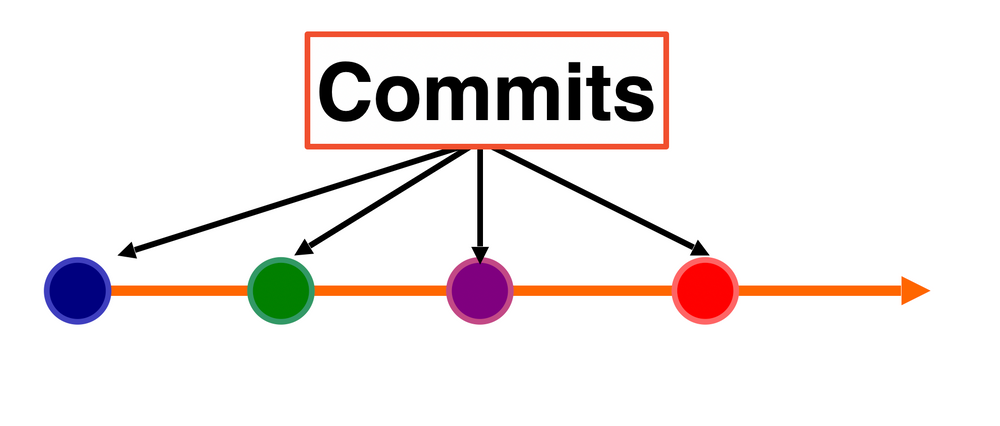

# 1-7 Git local

## Objetivo
Instalar Git, comprobar que funciona y crear un primer repositorio local para entender cómo guarda versiones.

## Idea clave
**Git** es una herramienta que guarda el historial de cambios de una carpeta de proyecto.

No trabaja sobre ideas abstractas: trabaja sobre archivos reales.

## Diferencia importante

- **Git**: herramienta local de control de versiones
- **GitHub**: plataforma online que usa Git para compartir repositorios

En esta clase vamos a trabajar solo con **Git local**.

## Material Complementario
- [Git explicado en forma simple](https://www.youtube.com/watch?v=3GymExBkKjE)
- [Curso de Git y GitHub desde cero - introducción](https://www.youtube.com/watch?v=HiXLkL42tMU)
- [Curso de Git - playlist de Felipe Gavilan Programa](https://www.youtube.com/playlist?list=PL0kIvpOlieSO0s8RI-1YJPMztAJ7TsUco)


## Sitio oficial
- [Git SCM](https://git-scm.com/)
- [Libro oficial de Git en español](https://git-scm.com/book/es/v2)

## Instalación en Windows

1. Ir a [https://git-scm.com/downloads](https://git-scm.com/downloads)
2. Descargar la versión para Windows.
3. Ejecutar el instalador.
4. Dejar, en general, las opciones marcadas por defecto.

## Cómo acceder a Git
Después de instalarlo, Git puede usarse de varias formas:

- desde **Git Bash**
- desde **PowerShell**
- desde la terminal integrada de **VS Code**

En estos primeros pasos usaremos la terminal **Git Bash**

## Verificar la instalación
Abrí una terminal, click derecho en la carpeta de trabajo, seleccioná _Git Bash Here_ y ejecutá:

```bash
git --version
git --help
```

Si Git está bien instalado, el primer comando debería mostrar una versión.

## Comandos base que vamos a usar hoy

| Acción | Comando |
|---|---|
| Iniciar repo | `git init` |
| Ver estado | `git status` |
| Agregar archivo | `git add archivo` |
| Agregar todo | `git add .` |
| Guardar versión | `git commit -m "mensaje"` |
| Ver historial corto | `git log --oneline` |

## Configuración inicial recomendada
Antes del primer commit, conviene configurar nombre y correo.

```bash
git config --global user.name "Tu Nombre"
git config --global user.email "tunombre@ejemplo.com"
```

Para revisar la configuración:

```bash
git config --global --list
```

## Actividad 1: crear un proyecto local

### Paso 1: crear carpeta

```bash
cd /c/temp2026/Testing2026_APELLIDO/Eje_1_Software_Colaborativo
mkdir mi_primer_repo_git
cd mi_primer_repo_git
```

### Paso 2: inicializar Git

```bash
git init
```

### Qué pasó
Git creó una carpeta oculta llamada `.git` dentro del proyecto.

Esa carpeta guarda el historial del repositorio.

verificar la existencia de `.git` con: 

```bash
ls -a 
```


## Actividad 2: crear un archivo y mirar el estado

### Paso 1: crear `README.md`

```bash
echo "# Mi primer repositorio Git" > README.md
```

### Paso 2: revisar el estado

```bash
git status
```

### Qué observar

- Git detecta que existe un archivo nuevo
- todavía no forma parte del historial

## Actividad 3: agregar y hacer el primer commit

### Paso 1: pasar el archivo al área de preparación

```bash
git add README.md
```

### Paso 2: guardar una versión

```bash
git commit -m "Agrego README inicial"
```

### Paso 3: ver el historial

```bash
git log --oneline
```

## Idea importante: las tres zonas de Git
Cuando trabajamos con Git, los cambios pasan por tres zonas:



- **Área de trabajo**: la carpeta del proyecto, donde editás los archivos.
- **Área de preparación**: los cambios que elegiste para el próximo commit.
- **Repositorio local**: el historial guardado dentro de la carpeta oculta `.git`.

En forma simple:

> escribo, selecciono, guardo versión.



Un **commit** es una versión guardada del proyecto. Funciona como una foto del estado de los archivos en un momento determinado.

## Actividad 4: modificar el proyecto

Agregar una segunda línea al `README.md`.

Podés hacerlo desde VS Code o desde **Git Bash** con este comando:

```bash
echo "Este repositorio se creó para practicar Git local." >> README.md
```

Ahora, ejecutar:

```bash
git status
git add README.md
git commit -m "Actualizo el README con una descripción"
git log --oneline
```

## Actividad 5: crear un archivo de código

Crear una carpeta nueva llamada `scripts`.

Dentro de esa carpeta, crear un archivo `saludo.py` con este contenido:

```python
print("Hola, Git")
```

Si querés crear la carpeta y el archivo desde terminal:

```bash
mkdir scripts
echo 'print("Hola, Git")' > scripts/saludo.py
```

Luego, mirar el estado:

```bash
git status
```

Para agregar cambios al área de preparación hay dos formas comunes:

```bash
git add .
```

`git add .` agrega todos los cambios nuevos o modificados que estén dentro de la carpeta actual del repositorio.

También se puede agregar un archivo específico:

```bash
git add scripts/saludo.py
```

`git add scripts/saludo.py` agrega solo ese archivo. Es útil cuando modificaste varias cosas, pero querés guardar en el próximo commit solamente una parte.

Después de elegir una de las dos formas, hacer el commit:

```bash
git commit -m "Agrego script saludo.py"
git log --oneline
```

## Actividad 6: leer el estado del repositorio
Responder con tus palabras:

1. ¿Qué hace `git init`?
2. ¿Qué muestra `git status`?
3. ¿Para qué sirve `git add`?
4. ¿Qué guarda un `commit`?
5. ¿Qué diferencia hay entre editar un archivo y hacer commit?

## Mini ejercicio guiado
Repetí esta secuencia:

```bash
git status
echo "Nueva línea de prueba" >> README.md
git status
git add README.md
git status
git commit -m "Agrego una nueva línea de prueba"
git log --oneline
```

La idea es mirar cómo cambia el estado en cada paso.

## Problemas comunes

### Git no reconoce tu identidad
Si aparece un mensaje pidiendo nombre o correo, configurá:

```bash
git config --global user.name "Tu Nombre"
git config --global user.email "tunombre@ejemplo.com"
```

### `git` no se reconoce como comando
Puede pasar si:

- Git no se instaló bien
- la terminal quedó abierta antes de instalar

Solución:

- cerrar y abrir la terminal
- volver a probar `git --version`

### Hice cambios pero no los veo en el historial
Probablemente faltó alguno de estos pasos:

- `git add`
- `git commit -m "mensaje"`

## Cierre conceptual
Git no guarda solo archivos: guarda momentos del proyecto.

Cada commit funciona como una foto con mensaje.

## Entrega sugerida

- captura de `git status`
- captura de `git log --oneline`
- carpeta del proyecto con `README.md` y `saludo.py`

## Próximo paso
Después de dominar Git local, el paso siguiente es entender:

- qué es un repositorio remoto
- para qué sirve GitHub
- cómo subir y bajar cambios
