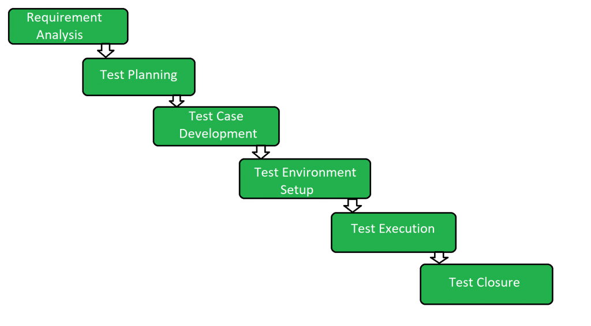

# Clase 5: Exploración y comunicación de bugs - AcademyBugs

**Pregunta guía:** ¿cómo podemos pasar de “esto funciona raro” a una explicación que ayude a otra persona?

## Objetivos de la clase

- Explorar una aplicación con una intención concreta.
- Diferenciar resultado esperado y resultado obtenido.
- Reconocer algunos tipos de bugs.
- Registrar observaciones, dudas y comportamientos inesperados.
- Comunicar un hallazgo con la información necesaria para que otra persona pueda entenderlo y, si es posible, repetirlo.

## Documento de trabajo

Cada pareja realiza **una sola entrega en Google Docs**.

1. Un integrante crea un documento dentro de la carpeta de Drive compartida con el profesor.
2. Nombra el documento `3-5_Apellido1_Apellido2_AcademyBugs`.
3. Comprueba que ambos integrantes puedan editarlo.
4. Copia en el documento las tablas y preguntas de esta guía.
5. Los dos integrantes registran las observaciones y pegan las capturas en ese mismo documento.

No es necesario encontrar una cantidad determinada de bugs. Una exploración que confirma que una función trabaja como se esperaba también es un resultado útil.

## Antes de explorar: ¿qué es un bug?

Un **bug** o defecto es un problema en el software que puede producir un comportamiento incorrecto. Durante una prueba observamos una **falla** cuando el resultado obtenido no coincide con el esperado.

Para analizar una situación conviene preguntar:

| Elemento | Pregunta que responde |
| --- | --- |
| Acción o entrada | ¿Qué hicimos o qué dato usamos? |
| Resultado esperado | ¿Qué pensábamos que iba a ocurrir y por qué? |
| Resultado obtenido | ¿Qué ocurrió realmente? |
| Evidencia | ¿Qué podemos mostrar para sostenerlo? |
| Repetición | ¿Otra persona podría probar algo parecido con esta información? |

La repetición ayuda a investigar, pero en una exploración inicial no siempre es posible repetir exactamente un comportamiento. En ese caso, registren lo que observaron y aclaren qué información falta.

### ¿Dónde entra esta actividad dentro del STLC?

El **STLC** (*Software Testing Life Cycle*, ciclo de vida del testing de software) describe cómo se organiza el trabajo de testing. No es un recorrido completamente separado del SDLC: acompaña el desarrollo y ayuda a transformar una necesidad en pruebas, resultados y decisiones.

De manera orientativa, podemos reconocer estas etapas:

```text
Comprender requisitos → Planificar y diseñar pruebas → Preparar el entorno
             → Ejecutar → Registrar defectos → Cerrar y comunicar resultados
```

En esta actividad van a practicar especialmente tres momentos:

- **Ejecutar:** recorrer la aplicación con una intención concreta.
- **Registrar defectos:** describir qué hicieron, qué esperaban y qué ocurrió.
- **Comunicar resultados:** aportar evidencia, dudas y datos para que otra persona pueda continuar investigando.



El diagrama es una guía orientativa: los nombres y el orden pueden variar según el equipo. Lo importante es entender que reportar un bug no consiste solamente en decir que algo “anda mal”, sino en comunicar evidencia útil.

### Tipos de bugs

Lean [Types of Bugs](https://academybugs.com/types/) y recorran [Examples of Bugs](https://academybugs.com/). El sitio presenta, entre otros, estos tipos:

- **Functional:** una función no hace lo que debería.
- **Visual:** un elemento se muestra de una manera incorrecta o dificulta su uso.
- **Content:** aparece información equivocada, incompleta o confusa.
- **Performance:** una respuesta tarda demasiado o la aplicación se vuelve lenta.
- **Crash:** la aplicación se cierra, se bloquea o deja de responder.

Elijan **dos tipos** y explíquenlos con palabras propias. Pueden usar un ejemplo del sitio o inventar uno sencillo.

Conversen: ¿un botón que no responde es siempre un problema visual? Justifiquen con una situación posible.

### Inglés que nos ayuda a navegar

| Interfaz | Significado |
| --- | --- |
| Find Bugs / Report Bugs | Buscar fallas / reportar fallas |
| Add to Cart / View Cart | Agregar al carrito / ver carrito |
| Expected Result / Actual Result | Resultado esperado / resultado obtenido |
| Steps / Attachments | Pasos / archivos o capturas adjuntas |

Pueden apoyarse en el traductor. Si lo usan, anótenlo en el documento y conserven los nombres originales de los botones cuando describan los pasos.

## Exploración de AcademyBugs

Entren a [Find Bugs](https://academybugs.com/find-bugs/), una tienda de práctica con fallas preparadas. Dedicarán unos minutos a reconocer sus zonas y después elegirán uno o dos recorridos para explorar.

Pueden elegir, por ejemplo:

- comparar productos en el catálogo;
- ordenar o filtrar productos;
- abrir la ficha de un producto;
- agregar un producto al carrito;
- cambiar la cantidad o quitar un producto;
- consultar otra sección de la tienda.

No necesitan completar una compra ni iniciar sesión. Si una parte del sitio no funciona, pueden elegir otro recorrido y dejar anotado lo ocurrido.

Antes de cada comprobación, conversen brevemente qué esperan que suceda. Luego registren algunas pruebas en la tabla. Pueden completar tres filas, o las que alcancen a trabajar con atención.

| Prueba | Qué hicimos y con qué datos | Resultado esperado | Resultado obtenido | Observación |
| --- | --- | --- | --- | --- |
| 1 |  |  |  |  |
| 2 |  |  |  |  |
| 3 |  |  |  |  |

En “Observación” pueden escribir, por ejemplo: `Funcionó como esperábamos`, `Sospechoso`, `No pudimos comprobarlo` o una explicación propia. No hace falta decidir inmediatamente si se trata de un bug: describir una duda con claridad también forma parte de explorar.

Si encuentran un comportamiento inesperado, vuelvan a probarlo una vez desde un punto de inicio claro. Si no vuelve a aparecer, conserven igualmente el registro y escriban que ocurrió una sola vez. No inventen pasos ni resultados que no hayan observado.

## Del hallazgo al reporte

Lean los campos de [Report Bugs](https://academybugs.com/report-bugs/). La sección tiene ejercicios guiados propios; para hacerlos, sigan el enlace y las indicaciones que aparecen allí. En esta clase, el reporte se escribe en el Google Doc y puede referirse a una falla, una observación sospechosa o una prueba que funcionó correctamente.

Elijan **una situación de la tabla** y desarrollen un registro más completo. Usen como ayuda estas preguntas:

| Campo | Pregunta orientadora |
| --- | --- |
| Título | ¿Dónde ocurre y qué observamos? |
| Inicio y pasos | ¿Qué hicimos para llegar a la situación? |
| Resultado esperado | ¿Qué creíamos que debía pasar y en qué nos basamos? |
| Resultado obtenido | ¿Qué pasó realmente? |
| Entorno | ¿Qué navegador y dispositivo usamos? |
| Evidencia | ¿Tenemos una captura o una descripción detallada? |
| Tipo posible | ¿Se parece a un bug funcional, visual, de contenido, de rendimiento o de caída? |
| Dudas | ¿Qué necesitaríamos comprobar mejor? |

No es necesario completar todos los campos si no cuentan con esa información. Indiquen qué pudieron observar y qué quedó pendiente. Si no encontraron un comportamiento sospechoso, pueden reportar una prueba que funcionó y explicar por qué esperaban ese resultado.

### Modelo breve

**Título:** El carrito conserva un producto después de quitarlo.

**Pasos:** Abrimos una ficha, presionamos `Add to Cart`, entramos a `View Cart` y elegimos quitar el producto.

**Resultado esperado:** El producto deja de aparecer y el total se actualiza.

**Resultado obtenido:** El producto desapareció, pero el total siguió mostrando el importe anterior.

**Evidencia y dudas:** Adjuntamos una captura del carrito. Faltaría comprobar si ocurre con otros productos.

El modelo es una orientación, no un formato para copiar literalmente. Un reporte puede estar incompleto y seguir siendo útil si deja claro qué se hizo y qué se observó.

## Compartir y mejorar

Intercambien el reporte con otra pareja o léanlo en voz alta dentro del grupo. La otra pareja intenta entenderlo y responde:

- ¿Qué parte se entiende con claridad?
- ¿Qué dato o paso ayudaría a comprenderlo mejor?
- ¿Qué quedó como duda?

Si tienen tiempo, mejoren una parte del reporte a partir de esa devolución. No es necesario lograr una reproducción idéntica: el objetivo es practicar cómo comunicar una observación y cómo pedir la información que falta.

## Cierre y entrega

En el mismo documento incluyan:

- nombres de los integrantes y fecha;
- explicación de dos tipos de bugs;
- la tabla de exploración con las pruebas realizadas;
- un reporte ampliado de una situación observada;
- una captura, si pudieron obtenerla;
- una breve devolución o revisión del reporte;
- la respuesta a la pregunta final.

**Pregunta final:** ¿qué información fue más útil para entender una prueba: los pasos, el resultado esperado, el resultado obtenido o la evidencia? Expliquen con un ejemplo de su trabajo.

Se valorará que el grupo registre lo que realmente hizo, diferencie lo esperado de lo obtenido y pueda explicar sus dudas. No se evaluará cuántos bugs encontró ni si logró completar todos los recorridos del sitio.

## Si el sitio o la conexión fallan

Avisen y registren qué ocurrió. No cuenten una caída de conexión como un bug preparado del sitio. Con indicación docente, pueden analizar un ejemplo de [Examples of Bugs](https://academybugs.com/), trabajar sobre una captura o practicar el reporte con una situación de la boletería de la clase 3-2.

## Recursos

- [Examples of Bugs](https://academybugs.com/).
- [Types of Bugs](https://academybugs.com/types/).
- [Find Bugs](https://academybugs.com/find-bugs/).
- [Report Bugs](https://academybugs.com/report-bugs/).
